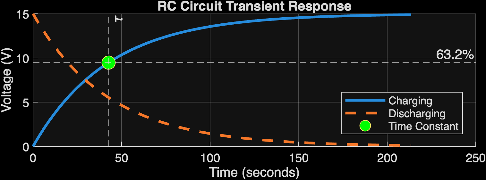

# ⚡ RC Circuit Transient Response Simulator

A MATLAB-based engineering simulation project that models capacitor charging and discharging behavior in a first-order RC circuit.

The project demonstrates transient response analysis, time constant calculations, MATLAB visualization, and App Designer development.

---

# Project Overview

Electrical circuits containing resistors and capacitors exhibit transient behavior when voltage changes occur.

This project simulates:

- Capacitor charging response
- Capacitor discharge response
- RC time constant calculation
- Voltage behavior over time
- Data export for analysis

The simulation is implemented using MATLAB and MATLAB App Designer.

---

# Engineering Model

The capacitor charging equation:

\[
V(t)=V_0(1-e^{-t/RC})
\]

The capacitor discharge equation:

\[
V(t)=V_0e^{-t/RC}
\]

The circuit time constant is:

\[
\tau = RC
\]

At one time constant:

\[
t=\tau
\]

the capacitor reaches approximately:

\[
63.2\%
\]

of the final charging voltage.

---

# Features

## 🔋 RC Circuit Simulation

- Configurable resistance
- Configurable capacitance
- Adjustable input voltage
- Charging and discharging modeling

---

## 📈 Data Visualization

The MATLAB simulation generates:

- Voltage vs Time plots
- Charging curve
- Discharging curve
- Time constant marker

---

## 🖥 MATLAB App Designer Interface

The interactive application provides:

- User input controls
- Simulation execution
- Graphical output display

---

# Project Files

RC-Circuit-Transient-Response

├── RC_Circuit_Project.m
├── RC_Circuit_Project.mlapp
│
├── docs
│ ├── index.html
│ ├── style.css
│ └── script.js
│
├── functions
└── plots

---

# Technologies Used

| Technology | Purpose |
|---|---|
| MATLAB | Simulation development |
| MATLAB App Designer | Interactive interface |
| Data Visualization | Engineering analysis |
| Git/GitHub | Version control |
| GitHub Pages | Project deployment |

---

# Results

Example simulation output:

---

# Engineering Skills Demonstrated

- Circuit analysis
- Differential equation modeling
- Transient system analysis
- MATLAB programming
- Data visualization
- Engineering documentation

---

# Future Improvements

- Add interactive parameter controls
- Add frequency response analysis
- Add Simulink model
- Export automated engineering reports
- Add real hardware validation

---

# Author

Jeremiah Lupton

Engineering Technology Portfolio Project

GitHub:
https://github.com/jd-dev-king
